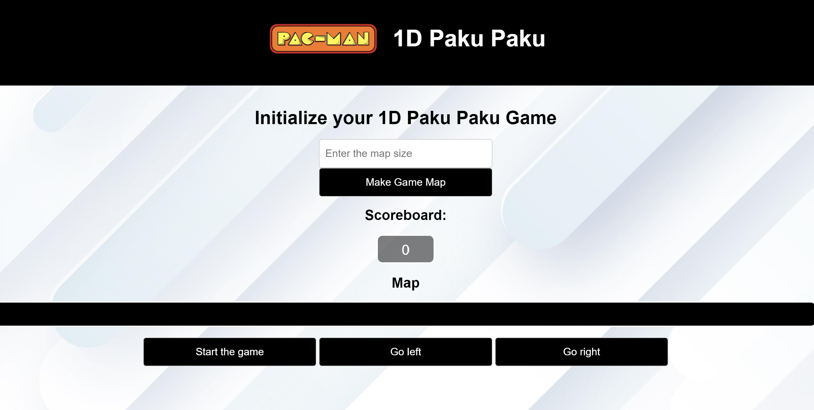

# Description
A 1-D version of the classic Pac-Man Arcade game where the goal is to collect all of the pellets to gain as high of a score as possible and traverse the next levels after collecting each pellet. There is also a ghost chasing you around to prevent you from eating all the pellete. However, by eating fruits in the game, you will be given the time to try eat the ghost to help you beat the level.

## User Interface

This is the inital game state

This is after setting a size of the map board 

