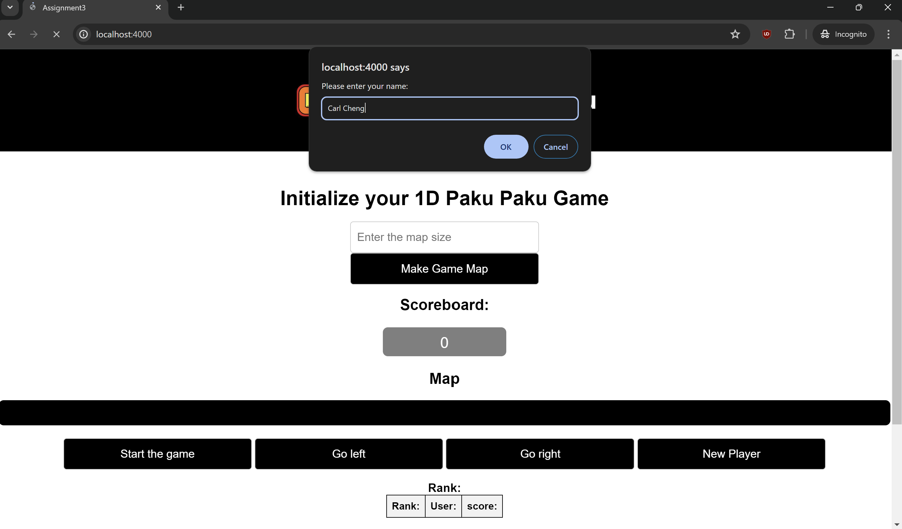
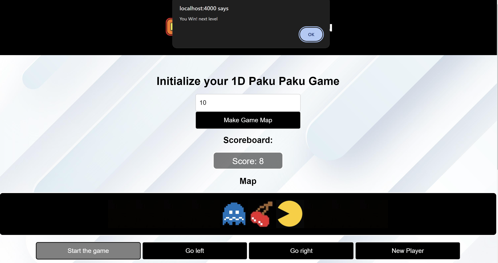
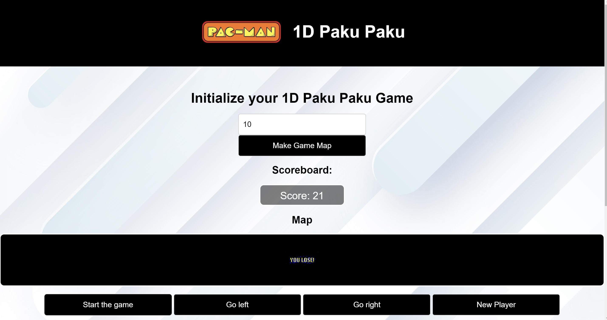

# PHP Enhanced 2-D Pacman Game

## Overview

This document provides a explanation of how PHP is used to enhance the 2-D Pacman game. It covers the implementation of Pacman models, managing the game state, and handling the leaderboard.

## Models

### Game.php

- **Attributes**: Manages Pacman, Ghost, map, score, size, and game status.
- **Methods**:
  - `makeMap($size)`: Initializes the map with Pacman, Ghost, and power-ups.
  - `run()`: Updates the map and checks the game status.
  - `updateMap()`: Handles movements and updates positions on the map.
  - `getScore()`: Retrieves the current score.
  - `updatePacmanLocation($pLocation, $pNext)`: Updates Pacman’s location and score.
  - `updateGhostLocation($gLocation, $gNext)`: Updates Ghost’s location.

### Ghost.php

- **Attributes**: Manages Ghost’s location and direction.
- **Methods**:
  - `get_Location()`: Retrieves Ghost’s location.
  - `setLocation($location)`: Sets Ghost’s location.
  - `move($map, $power)`: Moves Ghost based on Pacman’s power status.
  - `gohostRight($map)`: Moves Ghost to the right.
  - `gohostleft($map)`: Moves Ghost to the left.

### Pacman.php

- **Attributes**: Manages Pacman’s location, power status, and direction.
- **Methods**:
  - `get_location()`: Retrieves Pacman’s location.
  - `move($map)`: Moves Pacman based on the current direction.
  - `set_dir($dir)`: Sets Pacman’s direction.
  - `set_power($power)`: Sets Pacman’s power status.
  - `get_power()`: Retrieves Pacman’s power status.
  - `set_location($location)`: Sets Pacman’s location.

## API

### api.php

- **Initialization**: Manages game state and leaderboard.
- **Endpoints**:
  - `reset`: Destroys the session to reset the game.
  - `makeMap`: Initializes the game map with a given size.
  - `runGame`: Runs the game loop and returns the current status, score, and map.
  - `nextLevel`: Advances to the next level with a new map size.
  - `goRight`: Sets Pacman’s direction to right.
  - `goLeft`: Sets Pacman’s direction to left.
  - `record`: Records the score in `data.json`.
  - `read`: Reads and returns the leaderboard from `data.json`.

## Frontend

### index.php

- **HTML**: The Layout for the game interface including inputs, buttons, and scoreboards.
- **JavaScript**: Includes jQuery for handling UI interactions and making API calls to `api.php`.

## Leaderboard

### data.json

- **Structure**: Stores the scores of players in JSON using the rank of and usernames of the players which sorts the top 10 scores.

```json file
{
    "jiachen": 2,
    "0": 39,
    "jiachen3": 34,
    "Your Name": 2,
    "1": 2
}
```

## Screenshots of the Interface

### Inital Game State of entering Player Username



### Inital Map Size of the Game Board Created of Size 10


### You Win Screen State



### You Lose Screen State



### Game Leaederboard of top 10 Scores updated


