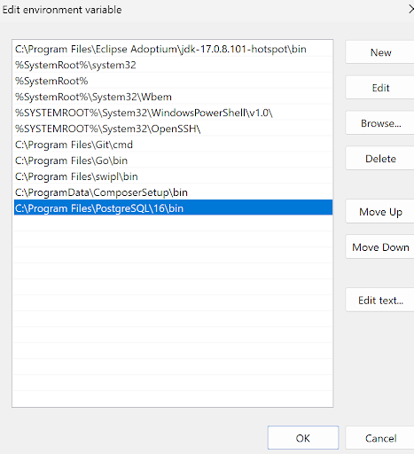
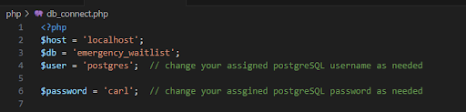
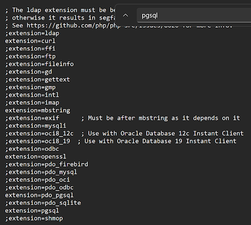
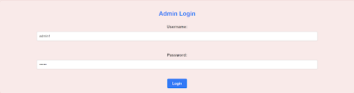
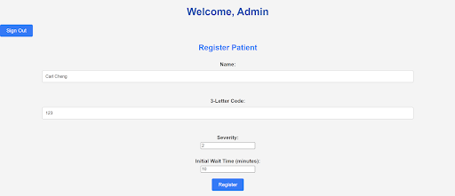
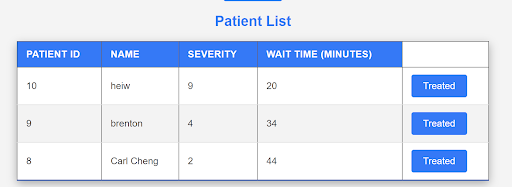
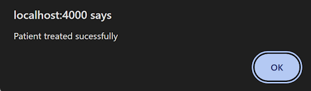
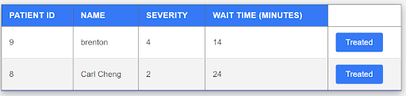
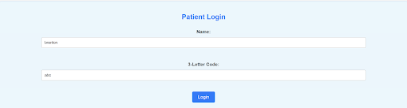

# Hotel Triage System Setup + Admin/Patient Perspectives

### How to setup application

- **Step 1**: Make sure PostgreSQL is installed on your system and PATH environment variable location is set to the bin folder of PostgreSQL

- **Step 2**: In terminal or command prompt enter the following commands in order

1. First connect to PostgreSQL
    Enter: psql -U postgres

2. Create the local database:
    Enter: CREATE DATABASE emergency_waitlist;

3. Connect to “emergency_waitlist” local database
    Enter: \c emergency_waitlist

- **Step 3**: After connecting to the database enter these SQL queries to create the tables

1. -- Create Patients Table, copy paste the following sql code into the terminal/cmd

CREATE TABLE Patients (
    patient_id SERIAL PRIMARY KEY,
    name VARCHAR(50) NOT NULL,
    unique_code CHAR(3) NOT NULL UNIQUE,
    severity INT NOT NULL,
    entry_time TIMESTAMP NOT NULL DEFAULT CURRENT_TIMESTAMP
);

2.  -- Create Admins Table, copy paste the following sql code into the terminal/cmd

CREATE TABLE Admins (
    admin_id SERIAL PRIMARY KEY,
    username VARCHAR(50) NOT NULL UNIQUE,
    password VARCHAR(255) NOT NULL
);

3. -- Create Wait Times Table, copy paste the following sql code into the terminal/cmd

CREATE TABLE WaitTimes (
    wait_id SERIAL PRIMARY KEY,
    patient_id INT NOT NULL,
    wait_time INT NOT NULL,
    FOREIGN KEY (patient_id) REFERENCES Patients(patient_id)
);

- **Step 4**:  insert Admin data into the table

Enter: INSERT INTO Admins (username, password) VALUES ('admin1', 'admin1');

- **Step 5**:  Enter repsective PostgreSQL username and password you use on your computer

## Additional Notes:

Make sure you are in the assignment folder directory when running -php -S localhost:4000

Admin user: admin1

Admin pass: admin1

If any additional errors occur while trying to log in to admin dashboard:

IN PHP.init file make sure these extensions are enabled by removing “;”

extension=pdo_pgsql

extension=pgsql

### Admin perspective

## Enter your admin username and password from the login screen:

## The first part of the admin’s dashboard allows you to register a patient given their name and assigned 3 letter code for the patient to use to log in. It is also required to assign the patient’s wait time and severity level.

## The patient’s list shows a list of patients waiting in queue and is dynamically changed based on the initial set wait time and severity level. If a person is registered with a higher severity level than another patient, they will go ahead in queue time and their wait time is then dynamically added on to patients with lower severity injuries.

## To treat a patient and remove them from a list, the first button “Treated” is always used. This removes the patient then dynamically changes the wait time of the other patients by subtracting the removed patient’s wait time with their wait time

## New Patient list and wait times

### Patient perspective

## Enter your name and three letter code assigned to you from the login screen

You will need to first register a patient through admin dashboard in order to log in

## Here you can see the patient’s dashboard that show you your estimated wait time:

